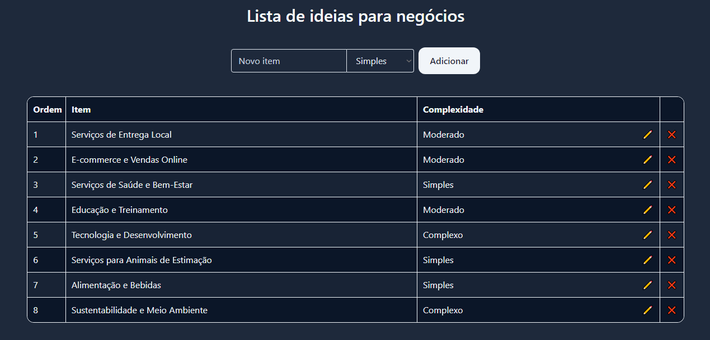

# Lista de Ideias para negócios

Lista de ideias para negócios customizável e responsível feita em React e Tailwind.

- https://github.com/mauricioraupp/ListaNegocios



## Iniciando

Essas instruções permitirão que você obtenha uma cópia do projeto em operação na sua máquina local para fins de desenvolvimento e teste.

Esse projeto pode ser executado usando npm.

O npm é um instância do Node.js, o que significa que se você baixar Node.js, o npm vem junto automaticamente. [Download Node.js](https://nodejs.org/en/download/package-manager)

## Como Instalar

- Para baixar o projeto siga as instruções abaixo:

```
1. git clone https://github.com/mauricioraupp/ListaNegocios.git
2. cd ListaNegocios
```

- Instale as dependências:

```
npm install
```

- Execute o servidor frontend

```
npm run start
```

## Componentes

- Lista de tarefas

Este componente é o principal para a criação da lista, ele possui toda a construção da tabela onde serão exibidos os itens da lista, ele também possui as funções de remover e editar o item da lista.

- Adicionar tarefa

Esta componente serve exclusivamente para adicionar um item à lista, junto com o select que permite botar a complexidade da ideia de negócio.

- Moon Icon 

Esse componente serve apenas para exibir o ícone da lua, que serve para alternar de modo noturno para claro.

## Hooks

- Darkmode

Esse hook tem a função que alterna entre o modo escuro e claro.

## App

O app, arquivo js principal do projeto, tem o objeto que contém os itens da lista de tarefas, onde todos os componentes são importados para conseguirem executar suas funções, fazendo a aplicação funcionar.